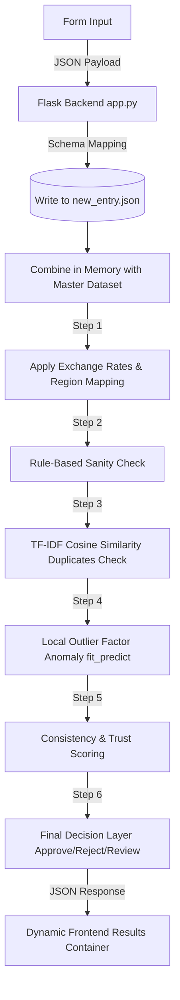

**Salary Consistency Validator & Outlier Detector**

**Overview**

Salary Consistency Validator & Outlier Detector is an AI-assisted data validation platform designed to improve the reliability of crowdsourced compensation data. The system combines rule-based validation, anomaly detection, duplicate detection, and market benchmarking to identify suspicious, inconsistent, or potentially fraudulent salary submissions in real time.

**Why It Matters**

Crowdsourced compensation platforms provide valuable salary transparency, but data quality issues such as typographical errors, duplicate submissions, and unrealistic compensation claims can significantly reduce trust in the dataset.

This solution serves as an intelligent validation layer that automatically evaluates incoming salary records before they are accepted into the database, ensuring higher accuracy and reliability.

**Key Features**

Rule-Based Consistency Validation

Detects logical inconsistencies in submitted records, including:

* Years at level exceeding years at company
* Unrealistic experience-to-seniority mappings
* Invalid compensation structures
* Missing or conflicting data fields

Anomaly Detection with Local Outlier Factor (LOF)

Applies machine learning–based anomaly detection to identify salary entries that significantly deviate from peer submissions within the same segment.

Segmentation Criteria:

* Job Family
* Seniority Level
* Country/Region

**Duplicate Submission Detection**

Prevents spam and repeated entries using:

* Text vectorization
* Cosine similarity matching
* Near-duplicate record identification

Global Salary Normalization

Supports multi-currency compensation data and converts values into a standardized USD equivalent for accurate cross-market comparison.

Supported currencies:

* USD
* INR
* EUR
* GBP
* CAD
* AUD

**Market Benchmark Validation**

Compares submitted compensation against benchmark ranges to identify:

* Unrealistically high salaries
* Suspiciously low compensation claims
* Potential data entry errors

Trust Scoring System

Generates a confidence score for each submission based on:

* Validation results
* Outlier probability
* Duplicate likelihood
* Benchmark alignment


## 💡 Why This is Useful

Crowdsourced compensation databases (like Glassdoor or Levels.fyi) are highly valuable, but they suffer from **data noise, typos, and malicious/fake submissions**. 

This solution acts as a **smart gatekeeper** by validating new entries immediately upon submission. It is extremely useful because it:
- **Catches Impossible Claims**: Instantly flags structural logical errors (e.g. years at level exceeding years at company, or junior-level entries claiming staff-level tenure).
- **Detects Segment Outliers**: Employs **Local Outlier Factor (LOF)** clustering to isolate salary entries that lie far outside the range of peer entries in the same segment (defined by `Job Family | Seniority Level | Country`).
- **Prevents Duplicate Spam**: Utilizes text vectorization and cosine similarity to spot duplicate entries sent in bulk.
- **Normalizes Global Data**: Seamlessly handles multiple currencies (USD, INR, EUR, GBP, CAD, AUD) by dynamically calculating standard USD conversions and evaluating against local market benchmarks.

---

## ⚙️ How It Works (The Pipeline Workflow)

When a user submits their salary details via the web interface, the following pipeline executes instantly:



### 1. Rule-Based Sanity Checks
Evaluates 10+ strict logical conditions (e.g. `Base Salary <= 0`, `Total Compensation < Base Salary`, `Years at Company > Years of Experience`) and sets immediate warnings if violations are found.

### 2. Multi-Dimensional Duplicate Detection
Combines role, company, salary, experience, and location into a text string and uses **TF-IDF vectorization** with **cosine similarity** to flag duplicate entries.

### 3. Local Outlier Factor (LOF) Analysis
Appends the new record into the dataset dynamically and fits a standard `Local Outlier Factor` model from Scikit-Learn. The algorithm measures local density deviations relative to peers in the exact same role segment. High scores indicate that ratios of base salary, stock grants, bonuses, or tenure are highly anomalous compared to peers.

### 4. final Scoring & Decision Layer
Assigns a **Consistency Score (0-100%)** and a **User Trust Score (0-1.0)**:
- **Approve (Inlier)**: Highly consistent data matching segment patterns.
- **Reject (Outlier)**: Glaring statistical anomalies.
- **Review (Needs Review / Unscored)**: Suspected benchmark deviations or duplicates that require a Human-in-the-Loop review.

---

## 🛠️ Tech Stack

- **Frontend**: HTML5, Vanilla CSS, Vanilla JavaScript (Event-driven, responsive form parsing, live math, fetch API integration).
- **Backend**: Python (Flask, Flask-CORS) serving static pages and classification endpoints.
- **Data & ML Pipeline**: NumPy, Pandas, Scikit-Learn (LocalOutlierFactor, StandardScaler, TfidfVectorizer, cosine_similarity).
- **Environments**: Configured for local running via `D:\Obj_detection\env\python.exe` and cloud deployments via **Vercel Serverless Functions**.

---

## 🚀 How to Run Locally

1. Make sure you have python virtual environment set up. Run the Flask server:
   ```bash
   D:\Obj_detection\env\python.exe app.py
   ```
2. Open your browser and navigate to:
   ```
   http://127.0.0.1:5000
   ```
3. Fill out the form, submit, and view real-time validation results at the bottom! Every submission is saved dynamically to `new_entry.json` in your workspace.
